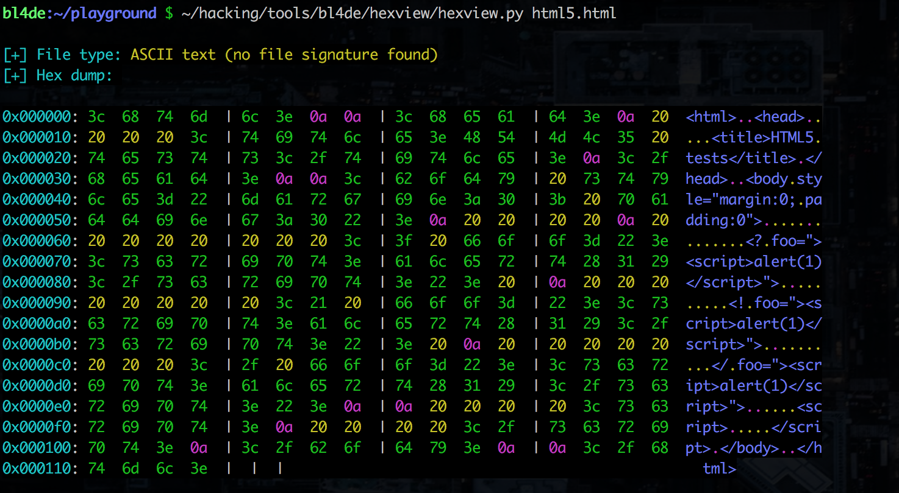
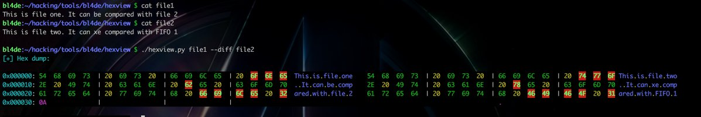

### hexview.py



hexview is an universal hex viewer for files. I've created this tool while learning some new Python skills from this awesome YT video tutorial by [DrapsTV](https://twitter.com/DrapsTV):


https://www.youtube.com/watch?v=B8nRrw_M_nk&index=1&list=WL


### Usage and options 


```
usage: hexview.py [-h] [-d] [-s START] [-e END] [-D DIFF] [-S] file

positional arguments:
  file                  Specify a file

optional arguments:
  -h, --help            show this help message and exit
  -d, --decimal         Display DEC values with HEX
  -s START, --start START
                        Start byte
  -e END, --end END     End byte
  -D DIFF, --diff DIFF  Perform diff with FILENAME
  -S, --shellcode       Extract shellcode (-s and -e has to be passed)

```


#### Basic usage:


```
$ hexview.py FILENAME
```

#### Decimal output


If you want to see decimal values of bytes as well, use ```-d```:

```
$ hexview.py -d FILENAME
```

#### Bytes range


Using ```-s``` (or ```--start```) and ```-e``` (or ```--end```) you can define range of bytes to display.


View first 128 bytes of file:

```
$ hexview.py -s 0 -e 128 FILENAME
```


#### Generating shellcode


```-S``` or ```--shellcode``` allows to extract part of binary in format which is used in C exploits (as char* or char[] type). ```-s``` and ```-e``` options need to be passed as well.

Here's sample C with shellcode:

```c
#include<stdio.h>
#include<string.h>

unsigned char code[] = 
"\x31\xc0\x50\x68\x6e\x2f\x73\x68\x68\x2f\x2f\x62\x69\x89\xe3\x50\x89\xe2\x53\x89\xe1\xb0\x0b\xcd\x80";

main()
{

    printf("Shellcode Length: %d\n", strlen(code));

    int (*ret)() = (int(*)())code;

    ret();
}
```

As you can see, a string with mnemonics contains ```\xhh``` values. To easy get such string from binary (eg. compiled asm file contains shellcode), this option can be used.


```
$ hexview.py -s 0 -e 128 --shellcode
```

The result is:

```
$ h -s 0 -e 128 --shellcode test.c

[+] Shellcode extracted from byte(s) 0x000000 to 0x000128:

\x69\x6e\x74\x20\x73\x28\x69\x6e\x74\x20\x78\x2c\x20\x69\x6e\x74\x20\x79\x29\x20\x7b\xa\x9\x72\x65\x74\x75\x72\x6e\x20\x78\x20\x2b\x20\x79\x3b\xa\x7d\xa\xa\x76\x6f\x69\x64\x20\x6d\x61\x69\x6e\x28\x29\x20\x7b\xa\x9\x69\x6e\x74\x20\x78\x20\x3d\x20\x31\x3b\xa\x9\x69\x6e\x74\x20\x79\x20\x3d\x20\x32\x3b\xa\xa\x9\x69\x6e\x74\x20\x73\x75\x6d\x20\x3d\x20\x73\x28\x78\x2c\x79\x29\x3b\xa\xa\x9\x72\x65\x74\x75\x72\x6e\x20\x73\x75\x6d\x3b\xa\x7d\xa

[+] Hex dump: 

0x000000: 69  6E  74  20  | 73  28  69  6E  | 74  20  78  2C  | 20  69  6E  74  int.s(int.x,.int
0x000010: 20  79  29  20  | 7B  0A  09  72  | 65  74  75  72  | 6E  20  78  20  .y).{..return.x.
0x000020: 2B  20  79  3B  | 0A  7D  0A  0A  | 76  6F  69  64  | 20  6D  61  69  +.y;.}..void.mai
0x000030: 6E  28  29  20  | 7B  0A  09  69  | 6E  74  20  78  | 20  3D  20  31  n().{..int.x.=.1
0x000040: 3B  0A  09  69  | 6E  74  20  79  | 20  3D  20  32  | 3B  0A  0A  09  ;..int.y.=.2;...
0x000050: 69  6E  74  20  | 73  75  6D  20  | 3D  20  73  28  | 78  2C  79  29  int.sum.=.s(x,y)
0x000060: 3B  0A  0A  09  | 72  65  74  75  | 72  6E  20  73  | 75  6D  3B  0A  ;...return.sum;.
0x000070: 7D  0A  00  00  | 00  00  00  00  | 00  00  00  00  | 00  00  00  00                    

```

#### Diff of two files

A ```-D``` (or ```--diff```) switch shows diff between two files. Bytes which are different are marked with red background.
As an argument for ```--diff``` a name of the file to compare needs to be passed.


Sample usage:

```
$ hexview FILENAME --diff FILENAME_TO_COMPARE
```


Sample output:




