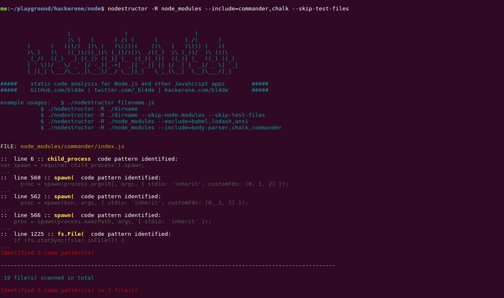

### nodestructor.py - static code analysis tool for Node.js applications


```nodestructor``` is a simple Python script to perform some basic static code analysis of installed npm modules in your ```node_modules``` directory, but it can be easily changed into universal JavaScript files scanner.

I've created this tool while working on [Node.js third-party modules Bug Bounty Program](https://hackerone.com/nodejs-ecosystem) on HackerOne and I just add any new "suspicious" code pattern that in certain conditions might lead to security vulnerability (like calls to ```fs``` module functions like ```readFile()``` or ```createReadStream()``` - without proper sanitization this sometimes leads to Path Traversals and Local File Include vulnerabilities - you can read more about such vulnerabilities found in many ```npm``` modules [here](https://github.com/bl4de/research/blob/master/npm-static-servers-most-common-issues/npm-static-servers-most-common-issues.md) )


You can use this tool and modify it as you want.


```
usage: nodestructor [-h] [-R] [-E EXCLUDE] [-S] [-T] filename

positional arguments:
  filename              Specify a file or directory to scan

optional arguments:
  -h, --help            show this help message and exit
  -R, --recursive       check files recursively
  -E EXCLUDE, --exclude EXCLUDE
                        comma separated list of packages to exclude from
                        scanning (eg. babel excludes ALL packages with babel
                        in name, like babel-register, babel-types etc.
  -S, --skip-node-modules
                        when scanning recursively, do not scan ./node_modules
                        folder
  -T, --skip-test-files
                        when scanning recursively, do not check test files
                        (usually test.js)

```




#### Scanning single file

The basic usage - scan single file:

```
$ nodestructor ./node_modules/path_to_module/sample_filename.js
```

This will give the following output:

```
$ nodestructor ./node_modules/nunjucks/src/filters.js 


#####  nodestructor.py - static code analysis for Node.js applications  #####
# GitHub: bl4de | Twitter: @_bl4de | hackerone.com/bl4de | bloorq@gmail.com #

examples:   $ ./nodestructor filename.js
            $ ./nodestructor -R ./dirname
            $ ./nodestructor -R ./dirname --skip-node-modules --skip-test-files
            $ ./nodestructor -R ./node_modules --exclude babel,lodash,ansi


FILE: ./node_modules/nunjucks/src/filters.js

::  line 591 :: <a.href.>  code pattern identified:  
      return "<a href=\"" + possibleUrl + "\"" + noFollowAttr + ">" + shortUrl + "</a>";

::  line 596 :: <a.href.>  code pattern identified:  
      return "<a href=\"http://" + possibleUrl + "\"" + noFollowAttr + ">" + shortUrl + "</a>";

::  line 601 :: <a.href.>  code pattern identified:  
      return "<a href=\"mailto:" + possibleUrl + "\">" + possibleUrl + "</a>";

::  line 606 :: <a.href.>  code pattern identified:  
      return "<a href=\"http://" + possibleUrl + "\"" + noFollowAttr + ">" + shortUrl + "</a>";

Identified 4 code pattern(s)

----------------------------------------------------------------------------------------------------

 1 file(s) scanned in total

Identified 4 code pattern(s) in 1 file(s)

```


#### -h

This option displays simple help with description of all available options.


#### -R or --recursive

This option forces ```nodestructor``` to scan all directories recursively. Typical usage will be like this (to scan all modules installed):

```
$ nodestructor -R ./node_modules/
```

To scan only one module, use:

```
$ nodestructor -R ./node_modules/module_name
```

#### -E or --exclude

Here a list of comma-separated module names can be provided, to omit scanning large modules, typically installed by default by many npm packages (like Babel etc.). This allows to provide an output to be more clear and focused only on interested modules.

Also, there is ```EXCLUDE_ALWAYS``` array defined directly in the source code file ```nodestructor.py```. Those modules are excluded from scanning always, no matter if ```-E``` option was set (just for convenience).

Example usage:

```
$ nodestructor -R ./node_modules/ --exclude=some_module,other_module,this_module_as_well
```

#### -T or --skip-test-files

This option allows to exclude form scanning typical test files, like ```test.js```, ```tests.js``` etc. Feel free to extend this for your needs (defined in source as ```TEST_FILES``` array)


#### Complete sample usage

After installing a template engine ```nunjucks``` (https://www.npmjs.com/package/nunjucks), I did a scan with following options set:

```
$ nodestructor -R node_modules/nunjucks/ --exclude=docs,browser,samples
```

The result was:

```

#####  nodestructor.py - static code analysis for Node.js applications  #####
# GitHub: bl4de | Twitter: @_bl4de | hackerone.com/bl4de | bloorq@gmail.com #

examples:   $ ./nodestructor filename.js
            $ ./nodestructor -R ./dirname
            $ ./nodestructor -R ./dirname --skip-node-modules --skip-test-files
            $ ./nodestructor -R ./node_modules --exclude babel,lodash,ansi


FILE: node_modules/nunjucks/src/filters.js

::  line 591 :: <a.href.>  code pattern identified:  
      return "<a href=\"" + possibleUrl + "\"" + noFollowAttr + ">" + shortUrl + "</a>";

::  line 596 :: <a.href.>  code pattern identified:  
      return "<a href=\"http://" + possibleUrl + "\"" + noFollowAttr + ">" + shortUrl + "</a>";

::  line 601 :: <a.href.>  code pattern identified:  
      return "<a href=\"mailto:" + possibleUrl + "\">" + possibleUrl + "</a>";

::  line 606 :: <a.href.>  code pattern identified:  
      return "<a href=\"http://" + possibleUrl + "\"" + noFollowAttr + ">" + shortUrl + "</a>";

Identified 4 code pattern(s)

----------------------------------------------------------------------------------------------------
FILE: node_modules/nunjucks/src/precompile.js

::  line 85 :: fs.File(  code pattern identified:  
    precompiled.push(_precompile(fs.readFileSync(input, 'utf-8'), opts.name || input, env));

::  line 93 :: fs.File(  code pattern identified:  
        precompiled.push(_precompile(fs.readFileSync(templates[i], 'utf-8'), name, env));

Identified 2 code pattern(s)

----------------------------------------------------------------------------------------------------
FILE: node_modules/nunjucks/src/node-loaders.js

::  line 96 :: fs.File(  code pattern identified:  
      src: fs.readFileSync(fullpath, 'utf-8'),

Identified 1 code pattern(s)

----------------------------------------------------------------------------------------------------

 36 file(s) scanned in total

Identified 7 code pattern(s) in 3 file(s)

```


#### LICENCE

This software is made under WTFPL Licence (https://pl.wikipedia.org/wiki/WTFPL)